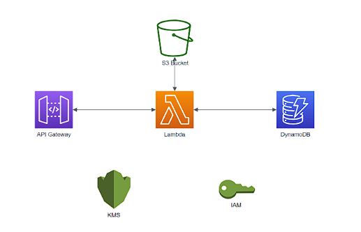
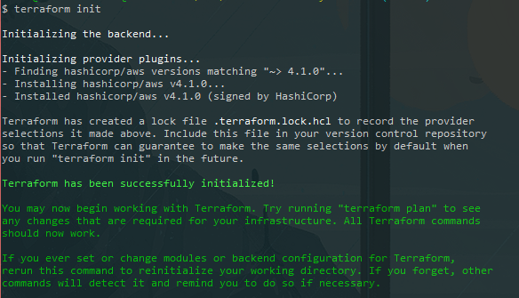
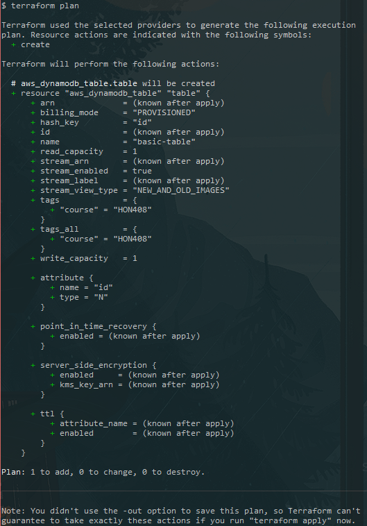
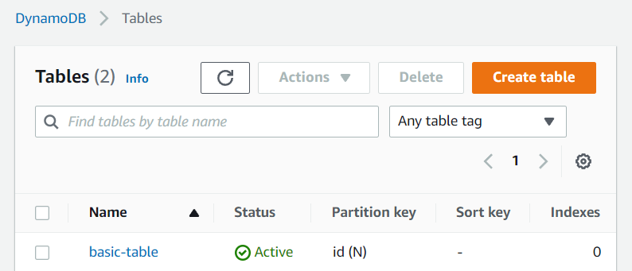
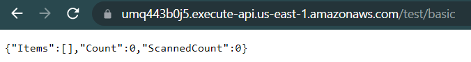

# TF-Serverless-Dynamo-API

A REST API on AWS deployed by Terraform that connects to a DynamoDB Database.

## Walkthrough

Before I begin my walkthrough of how to develop a REST API using AWS products, I am going to define a few useful tools and products to help better show my process. I am also going to describe tools and products as I use them throughout. AWS, an acronym for Amazon Web Services, is a public cloud system created by Amazon that dominates the public cloud sphere - providing a multitude of services to startups, enterprises, and government agencies alike. AWS allows anyone with a computer to create and host applications, websites, store data, and do several other things that would otherwise require physical servers and a decent amount of money. Before you begin, you need an AWS account, so make sure that is set up. I am also using a Windows machine, through git bash, so this may work much differently if you use MacOS or Linux. I have a Github repo set up here: https://github.com/ZaderRox1111/TF-Serverless-Dynamo-API that contains all of my code.

To start, I am going to go over the architecture and the services that we are going to use here. The basic overview of the system is a DynamoDB database connected to a Lambda function, which is connected to the API Gateway. Here is the architecture diagram:



DynamoDB is a nonrelational database, meaning that it uses key-value pairs to store data. Lambda is a way to run code without needing a server, and it is storing the code on an S3 bucket. There is a REST API that is created on the API Gateway that uses routes and stages in order to send HTTP requests. The API will send events to the Lambda function which will process the events and send calls to the database with the aws-sdk. Roles, policies, and keys are used throughout to allow the services to do certain actions.

First things first, you need to connect to AWS with an admin user’s access ID and secret access key. To do this sign into the AWS console and navigate to the Identity and Access Management (IAM) page. Find and click on the user with administrator access, go to the security credentials tab, and ‘Create access key’. Make sure to save the secret access key because you will never be able to recover it!

After you get your ID and key, you need to export them as environment variables. Either manually export them like so:

```bash
export AWS_ACCESS_KEY=XXXXXXXXXXX
export AWS_SECRET_ACCESS_KEY=XXXXXXXXXXXXX
```

Or create a bash script that will export those for you. You can also set up the AWS CLI to have those credentials set as environment variables for you.

Now that those are all set, it’s time to write some Terraform. To start, we need to set up our AWS providers so that Terraform knows what region and what account to deploy these services to. You need an admin role arn in order to connect to the providers, but don’t worry about that just yet. Create a main.tf file, and add the following until your file looks the same:

```javascript
data "aws_caller_identity" "current" {}

provider "aws" {
  region = var.region
}

provider "aws" {
  alias  = "us-east-1"
  region = var.region
  assume_role {
    role_arn = "arn:aws:iam::${data.aws_caller_identity.current.account_id}:role/${admin_role}"
  }
}

provider "aws" {
  alias  = "us-west-2"
  region = var.second_region
  assume_role {
    role_arn = "arn:aws:iam::${data.aws_caller_identity.current.account_id}:role/${admin_role}"
  }
}

terraform {
  required_providers {
    aws = {
      source  = "hashicorp/aws"
      version = "~> 4.1.0"
    }
  }
}
```

This essentially tells Terraform what you are using (AWS), what role to use in order to deploy services, and what providers that it needs to download (required_providers). Let’s understand the role_arn quickly - we are calling AWS on line 1 to get some stats about our current identity and using the ID that we receive to populate our arn. This is also a great place to show one of the ways to create variables we can use across the project.

Create a file named variables.tf and use my file as a template:

```javascript
variable "admin_role" {
  default = "tf-hon-408-role"
}

variable "region" {
  default = "us-east-1"
}

variable "second_region" {
  default = "us-west-2"
}

variable "course" {
  default = "HON408"
}
```

In the same IAM page you were at before, create a new role named anything you want (mine was named ‘tf-hon-408-role’) and give it an AdministratorAccess policy. Take that name you created and put it as the default to the variable.

There are only four Terraform commands that you will mostly ever use. ‘terraform init’ is the first, and it will read your providers and terraform block to see what it needs to download. If you have a remote state backend, this command will also read the state files from your backend to initialize everything. For the purposes of this walkthrough we will not be using a remote state backend. Run ‘terraform init’ and you should get something similar to this:



This means everything is set up properly! You’ll notice that a new folder called .terraform/ and a new file called .terraform.lock.hcl have been created within your directory. These provide the modules and information needed for you to actually plan and deploy things, so don’t delete them. It would be beneficial to create a .gitignore file (you could use the github template for Terraform) following a similar structure:

```python
# Local .terraform directories
**/.terraform/*

# .tfstate files
*.tfstate
*.tfstate.*

.terraform*
terraform.tfvars

output

# Crash log files
crash.log

# Ignore any .tfvars files that are generated automatically for each Terraform run. Most
# .tfvars files are managed as part of configuration and so should be included in
# version control.
#
# example.tfvars

# Ignore override files as they are usually used to override resources locally and so
# are not checked in
override.tf
override.tf.json
*_override.tf
*_override.tf.json

# Include override files you do wish to add to version control using negated pattern
#
# !example_override.tf

# Include tfplan files to ignore the plan output of command: terraform plan -out=tfplan
# example: *tfplan*
```

Now let's actually create something! We’ll start with the most basic DynamoDB table and move on from there. Create a dynamo.tf file and put the following inside (feel free to leave out the tags or make your own):


The second command that you will use is ‘terraform plan’. This command will show you what would theoretically happen if you were to deploy services right now. It will show you errors if you have them, give you warnings if things are missing, and it will show you exactly what is going to be built / changed / destroyed if you were to apply the code. If you run it, you can see that you have to input a region. There are multiple ways to supply a region without needing to input it here, but for now we’ll just put in us-east-1 (Quick fix - you can also add another aws provider in main.tf that only has a region value). After inputting the region, you will see everything that would be added:



Exactly what we are looking for! Look over this and see if this is what you actually want every time you plan on deploying services. Now let's apply it. Run ‘terraform apply’ to actually create the services, and look at it on your AWS console to see the created things.



Now we want to get rid of the Dynamo table with the final command, ‘terraform destroy’. Using this command will destroy all resources that you created before in here and kill all services that we deployed with ‘apply’. Run this command, and see your table disappear. 

Now that we have the basics down, let’s move on to more complex things. Our next goal is a DynamoDB global table V2 so that there is some disaster recovery in place and multiple endpoints available for the table. For the purposes of this walkthrough as well, we are going to create our own Customer Managed Key (CMK) with Key Management Services (KMS) so that we are in control of our table’s encryption. This is a much larger leap into Terraform than creating a basic table so take the time to read through and understand the code. To start, we need to make an IAM policy for the key that allows us to access the table with Lambda, so create a new file named keys.tf and put the following within it:

```javascript
data "aws_iam_policy_document" "ddb_key_policy" {
  policy_id = "hon-408-ddb-key-policy"

  statement {
    sid     = "Deployer has full access"
    actions = ["kms:*"]

    principals {
      type = "AWS"
      // MUST be root user for all of these or else you get AccessDeniedError on Lambda
      identifiers = [ "arn:aws:iam::${data.aws_caller_identity.current.account_id}:root" ]
    }

    resources = [ "*" ]
  }

  statement {
    sid     = "AWS permissions for cloudwatch logging"
    actions = [ "kms:GenerateDataKey*", "kms:Decrypt", "kms:Encrypt" ]

    principals {
      type        = "Service"
      identifiers = [ "cloudwatch.amazonaws.com", "s3.amazonaws.com", "events.amazonaws.com" ]
    }

    resources = [ "*" ]
  }
}

// Send the policy document to a json so we can use it
resource "local_file" "kms_policy_json" {
  content  = data.aws_iam_policy_document.ddb_key_policy.json
  filename = "${path.module}/output/kmsPolicy.json"
}
```

Now we have to actually create the key and replicate it. You need the AWS CLI, so install it on your machine now, and verify that you can run ‘aws’ commands with ‘aws --version’. Afterwards, add the following to your keys.tf file:

```javascript
// Actually create the key using the permissions from the IAM policy
resource "aws_kms_key" "ddbv2_encryption_key" {
  description         = "This key is used in HON408 to encrypt V2 ddb tables"
  policy              = data.aws_iam_policy_document.ddb_key_policy.json
  enable_key_rotation = true
  multi_region        = true
}

resource "aws_kms_alias" "ddb_key_alias-use1" {
  name = "alias/us-east-1-hon-408-ddb"
  target_key_id = aws_kms_key.ddbv2_encryption_key.id
}

// Key replication portion
// We need to make a second key that we can use on the second region of the table
// You need to download the aws cli in order to run this
resource "null_resource" "replicate_key" {
  depends_on = [ aws_kms_key.ddbv2_encryption_key ]

  provisioner "local-exec" {
    interpreter = ["bash", "-c"]
    command     = "aws kms replicate-key --key-id ${aws_kms_key.ddbv2_encryption_key.id} --replica-region ${var.second_region} --policy file://${path.module}/output/kmsPolicy.json --region ${var.region} --description 'Second region encryption'"
  }
}

resource "null_resource" "put_key_policy_usw2" {
  depends_on = [null_resource.replicate_key]

  // Add a trigger so that it will happen every apply
  triggers = {
    build_number = timestamp()
  }

  provisioner "local-exec" {
    interpreter = ["bash", "-c"]
    command     = "aws kms put-key-policy --key-id ${aws_kms_key.ddbv2_encryption_key.id} --policy-name default --policy file://${path.module}/output/kmsPolicy.json --region ${var.second_region}"
  }
}

resource "aws_kms_alias" "ddb_key_alias_usw2" {
  name = "alias/us-west-2-hon-408-ddb"
  target_key_id = aws_kms_key.ddbv2_encryption_key.id
}
```

This section of code will create a kms key and its alias with multi_region and key_rotation, then replicate the key and its policy over to the second region with bash commands and the AWS CLI.

Next, we use these keys to replicate a DynamoDB table, and create the global table. Replace your dynamo.tf with the following:

```js
resource "aws_dynamodb_table" "table" {
  depends_on = [aws_kms_key.ddbv2_encryption_key, null_resource.replicate_key, null_resource.put_key_policy_usw2]
  
  // Provisioned is no longer available with global tables
  hash_key         = "id"
  name             = "basic-table"
  billing_mode     = "PAY_PER_REQUEST"
  stream_enabled   = true
  stream_view_type = "NEW_AND_OLD_IMAGES"

  // Adding attributes and the hash key
  // Can be of type S (string), N (number), or B (binary)
  attribute {
    name = "id"
    type = "N"
  }

  // Adding our own encryption with our KMS CMK
  server_side_encryption {
    enabled     = true
    kms_key_arn = aws_kms_key.ddbv2_encryption_key.arn
  }

  // If you need to add tags
  tags = {
    course = var.course
  }

  // Creating the replica / global table
  replica {
    region_name = var.second_region
    kms_key_arn = replace(aws_kms_key.ddbv2_encryption_key.arn, var.region, var.second_region)
  }
}

// Replicate the tags in a similar way as the key replication
resource "null_resource" "replicate_table_tags_usw2" {
  depends_on = [aws_dynamodb_table.table]

  // Add a trigger so that it will happen every apply
  triggers = {
    build_number = timestamp()
  }

  provisioner "local-exec" {
    interpreter = ["bash", "-c"]
    command     = "aws dynamodb tag-resource --resource-arn ${replace(aws_dynamodb_table.table.arn, var.region, var.second_region)} --tags 'Key'='course','Value'='${var.course}' --region ${var.second_region}"
  }
}
```

If you were to apply and check the console, in KMS you’ll see that your two keys have been created. If you experience a KMSInvalidStateException it is because your replicated key is pending deletion. All you have to do is cancel the deletion on your online console and enable the key again. And if you check the DynamoDB console you’ll see that it now has a replica, so any items inputted will be replicated across all global tables.


Next up is adding a Lambda function that can access the table. Lambda code needs to be stored on an S3 bucket, so we need to write the Node.js code for the function to run and deploy it to an S3 bucket. Create a new directory within this one named lambda, and put another directory named ddbLambda with the file ddbLambda.js inside of that one. Now we are going to write our Lambda function’s code, and we’ll use the aws-sdk to make calls to the database much easier. The link to the aws-sdk DynamoDB documentation we will use is [here](https://docs.aws.amazon.com/AWSJavaScriptSDK/latest/AWS/DynamoDB/DocumentClient.html). The Lambda function processes based off of the exports.handler, so essentially what you run in there is what will be executed by the Lambda function. We are processing an event created by the API Gateway, and using the body and method provided to make calls to the database. The callback with this structure will allow the API Gateway to properly deliver the results to the user that hits it. Add this to your ddbLambda.js file (this is simple Node.js code):

```js
const AWS = require('aws-sdk');
const ddb = new AWS.DynamoDB.DocumentClient();

const TABLENAME = 'basic-table';

exports.handler = async (event, context, callback) => {
  console.log('Received event: ', JSON.stringify(event, null, 2));

  let body = JSON.parse(event.body);

  let statusCode = 200;
  let headers = {
    'Access-Control-Allow-Origin': '*'
  }
  let method = event.httpMethod;

  let response;

  try {
    switch (method) {
      case 'GET':
        response = await getTable();
        break;
      case 'PUT':
        response = await putItem(body);
        break;
      case 'DELETE':
        response = await deleteItem(body);
        break;
    }
  } catch (error) {
    statusCode = 400;
    response = error.message;
  } finally {
    response = JSON.stringify(response);
  }

  callback(null, {
    statusCode,
    body: response,
    headers
  });
}

async function getTable() {
  const params = {
    TableName: TABLENAME
  };

  let response;
  await ddb.scan(params, (err, data) => {
    response = (err ? err : data);
  }).promise()

  return response;
}

async function putItem(body) {
  const params = {
    TableName: TABLENAME,
    Item: body
  };

  let response;
  await ddb.put(params, (err, data) => {
    response = (err ? err : data);
  }).promise()

  return response;
}

async function deleteItem(body) {
  const params = {
    TableName: TABLENAME,
    Key: {
      id: body.id
    }
  };

  let response;
  await ddb.delete(params, (err, data) => {
    response = (err ? err : data);
  }).promise()

  return response;
}
```

Now we have to deploy this code to a S3 bucket so our Lambda function can access it. What is cool about Terraform is that they have a way to zip files and upload them to s3 buckets from your code. This means that everything is automatic, and you never have to dig into your AWS console to do anything. Create a file named s3.tf and add the following code:

```js
// VERY IMPORTANT: on Terraform AWS 4.0+ the s3 bucket creation changed drastically
// Make sure you are looking at the new docs on Terraform to make s3 buckets
resource "aws_s3_bucket" "encryption" {
  bucket = "tf-hon-408-s3-bucket"

  tags = {
    course = var.course
  }
}

// Making it private
resource "aws_s3_bucket_acl" "encryption" {
  bucket = aws_s3_bucket.encryption.id
  acl    = "private"
}

// Creating the zip file
data "archive_file" "ddbLambda_zip" {
  type        = "zip"
  source_dir  = "${path.module}/lambda/ddbLambda"
  output_path = "${path.module}/lambda/ddbLambda.zip"
}

resource "aws_s3_object" "file_upload" {
  depends_on = [data.archive_file.ddbLambda_zip]

  bucket = aws_s3_bucket.encryption.id
  key    = "lambda/ddbLambda.zip"
  source = data.archive_file.ddbLambda_zip.output_path
}
```

If you were to apply the code right now, you would see the folder get zipped and put onto the s3 bucket. Next we have to create new IAM policies and a role for the Lambda function and the function itself within a new file called lambda.tf:

```js
resource "aws_iam_role_policy" "lambda_policy" {
  name     = "lambda_policy"
  role     = aws_iam_role.role_for_LDC.id

  policy = jsonencode({
    "Version": "2012-10-17",
    "Statement": [{
      "Effect": "Allow",
      "Action": [
        "dynamodb:DeleteItem",
        "dynamodb:GetItem",
        "dynamodb:PutItem",
        "dynamodb:Scan",
        "dynamodb:UpdateItem"
      ],
      "Resource": "arn:aws:dynamodb:us-east-1:${data.aws_caller_identity.current.account_id}:table/*"
    },
    {
      "Effect": "Allow",
      "Action": "logs:CreateLogGroup",
      "Resource": "arn:aws:logs:us-east-1:${data.aws_caller_identity.current.account_id}:*"
    },
    {
      "Effect": "Allow",
      "Action": ["logs:CreateLogStream", "logs:PutLogEvents"],
      "Resource": "arn:aws:logs:us-east-1:${data.aws_caller_identity.current.account_id}:log-group:/aws/lambda/ddbLambda:*"
    },
    {
      "Sid": "NetworkInterface",
      "Effect": "Allow",
      "Action": [
        "ec2:DescribeNetworkInterfaces",
        "ec2:DescribeInstances",
        "ec2:DeleteNetworkInterface",
        "ec2:CreateMetworkInterface",
        "ec2:AttachNetworkInterface"
      ],
      "Resource": "*"
    },
    {
      "Sid": "KMSDecrypt",
      "Effect": "Allow",
      "Action": ["kms:*"],
      "Resource": "*"
    }]
  })
}

resource "aws_iam_role" "role_for_LDC" {
  name = "ddbLambda"

  assume_role_policy = jsonencode({
    "Version": "2012-10-17",
    "Statement": [{
      "Effect": "Allow",
      "Principal": {
        "Service": "lambda.amazonaws.com"
      },
      "Action": "sts:AssumeRole"
    }]
  })
}
```

Now to actually create the lambda function. Don’t worry about the rest api at the bottom, we will get to that after we set up the api:

```js
resource "aws_iam_role" "role_for_LDC" {
  name = "ddbLambda"

  assume_role_policy = jsonencode({
    "Version": "2012-10-17",
    "Statement": [{
      "Effect": "Allow",
      "Principal": {
        "Service": "lambda.amazonaws.com"
      },
      "Action": "sts:AssumeRole"
    }]
  })
}

// Lambda function
resource "aws_lambda_function" "lambda" {
  depends_on = [aws_kms_key.ddbv2_encryption_key]

  function_name = "ddbLambda"
  s3_bucket     = "tf-hon-408-s3-bucket"
  s3_key        = aws_s3_object.file_upload.key
  role          = aws_iam_role.role_for_LDC.arn
  handler       = "ddbLambda.handler"
  runtime       = "nodejs12.x"

  kms_key_arn = aws_kms_key.ddbv2_encryption_key.arn
}

// Defining Lambda and Api permissions
resource "aws_lambda_permission" "lambda_permission" {
  statement_id = "AllowExecutionFromAPIGateway"
  action = "lambda:InvokeFunction"
  function_name = aws_lambda_function.lambda.function_name
  principal = "apigateway.amazonaws.com"

  // Allows requests from any route on stage test
  source_arn = "${aws_api_gateway_rest_api.rest_api.execution_arn}/test/*/*"
}
```

The final file we will create is api.tf. This will create a REST API through API Gateway and set up the paths and lambda integrations for the routes. Copy the following into your file:

```js
resource "aws_api_gateway_rest_api" "rest_api" {
  name        = "tf-hon-408-ddb-api"
  description = "API created through Terraform that connects to a DynamoDB database"
  tags = {
    course = var.course
  }
}

// Setting up routes
resource "aws_api_gateway_resource" "basic_resource" {
  rest_api_id = aws_api_gateway_rest_api.rest_api.id
  parent_id   = aws_api_gateway_rest_api.rest_api.root_resource_id
  path_part   = "basic"
}

// Integrating methods with Lambda
resource "aws_api_gateway_method" "get_method" {
  rest_api_id   = aws_api_gateway_rest_api.rest_api.id
  resource_id   = aws_api_gateway_resource.basic_resource.id
  http_method   = "GET"
  authorization = "NONE"
}
resource "aws_api_gateway_integration" "get_method" {
  rest_api_id = aws_api_gateway_rest_api.rest_api.id
  resource_id = aws_api_gateway_resource.basic_resource.id
  http_method = aws_api_gateway_method.get_method.http_method

  integration_http_method = "POST"
  type                    = "AWS_PROXY"
  uri                     = aws_lambda_function.lambda.invoke_arn
}

resource "aws_api_gateway_method" "put_method" {
  rest_api_id   = aws_api_gateway_rest_api.rest_api.id
  resource_id   = aws_api_gateway_resource.basic_resource.id
  http_method   = "PUT"
  authorization = "NONE"
}
resource "aws_api_gateway_integration" "put_method" {
  rest_api_id = aws_api_gateway_rest_api.rest_api.id
  resource_id = aws_api_gateway_resource.basic_resource.id
  http_method = aws_api_gateway_method.put_method.http_method

  integration_http_method = "POST"
  type                    = "AWS_PROXY"
  uri                     = aws_lambda_function.lambda.invoke_arn
}

resource "aws_api_gateway_method" "delete_method" {
  rest_api_id   = aws_api_gateway_rest_api.rest_api.id
  resource_id   = aws_api_gateway_resource.basic_resource.id
  http_method   = "DELETE"
  authorization = "NONE"
}
resource "aws_api_gateway_integration" "delete_method" {
  rest_api_id = aws_api_gateway_rest_api.rest_api.id
  resource_id = aws_api_gateway_resource.basic_resource.id
  http_method = aws_api_gateway_method.delete_method.http_method

  integration_http_method = "POST"
  type                    = "AWS_PROXY"
  uri                     = aws_lambda_function.lambda.invoke_arn
}
```

Now we have to deploy the API and create the stage (test):

```js
// Deploy the API
resource "aws_api_gateway_deployment" "api_deployment" {
  depends_on = [aws_api_gateway_integration.get_method, aws_api_gateway_integration.put_method, aws_api_gateway_integration.delete_method]

  rest_api_id = aws_api_gateway_rest_api.rest_api.id

  lifecycle {
    create_before_destroy = true
  }
}

resource "aws_api_gateway_stage" "test" {
  stage_name = "test"
  rest_api_id = aws_api_gateway_rest_api.rest_api.id
  deployment_id = aws_api_gateway_deployment.api_deployment.id
}

output "url" {
  value = aws_api_gateway_deployment.api_deployment.invoke_url
}
```

Run ‘terraform apply’ to deploy the API. As you can see it outputs an endpoint that you can invoke, just make sure to add the route ‘basic’ to the end of it.

If we navigate to the AWS console and send Lambda a test event like so: 


we can see it return the DynamoBD table’s contents (which happens to be empty).


This is the best way to test errors with your lambda functions, because it helps you pinpoint what isn’t working. I made several errors over the course of this walkthrough that I fixed by tweaking things in the Lambda function, so make sure that tests are working before moving on. Now if we go to the API Gateway page, and click on the invoke url given under the stages tab, we can see the API working! 



That is my walkthrough of a very simple API using AWS. Feel free to destroy the resources afterwards in order to eliminate costs if you do not need the API with ‘terraform destroy’.
